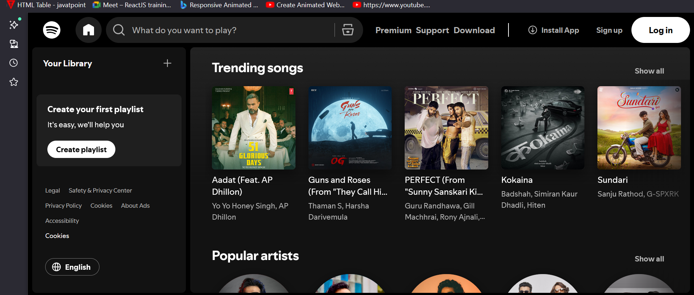
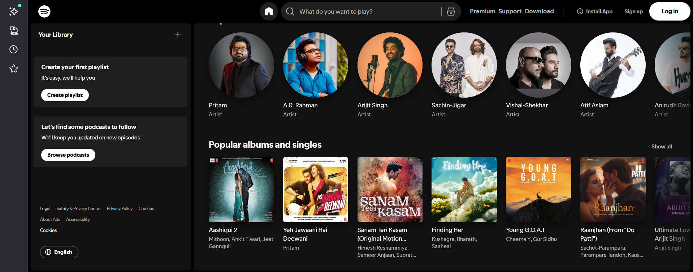
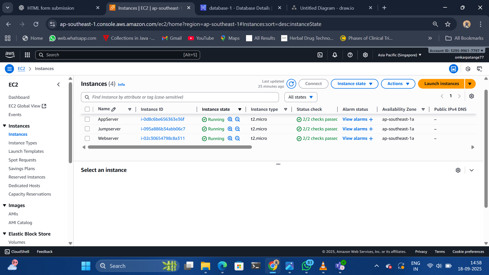
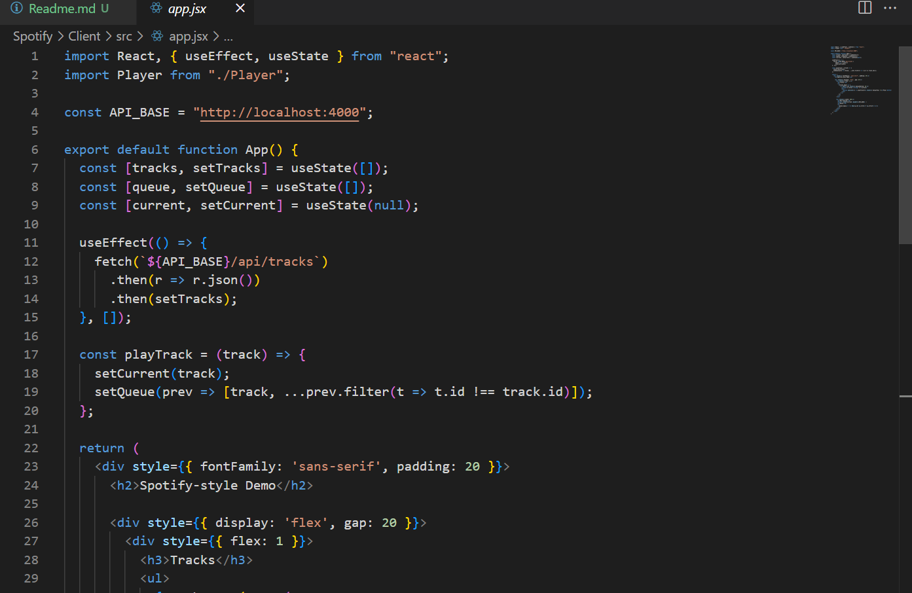
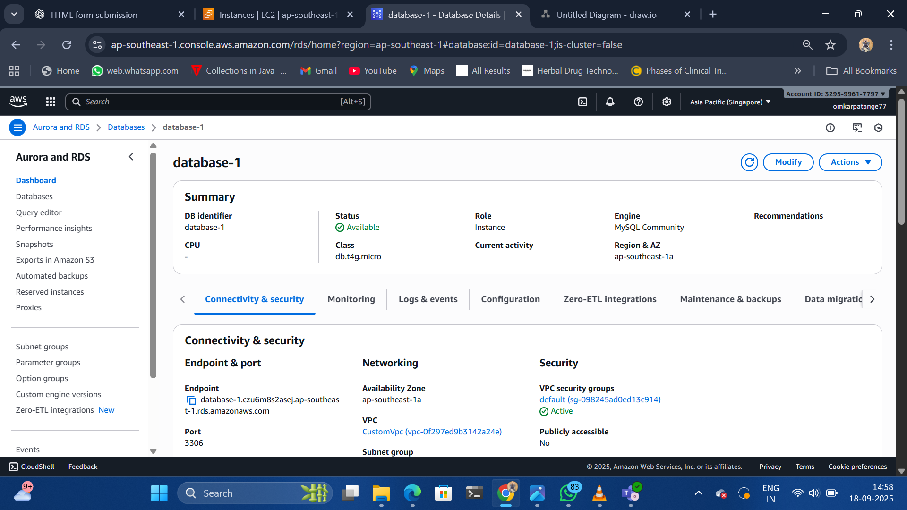
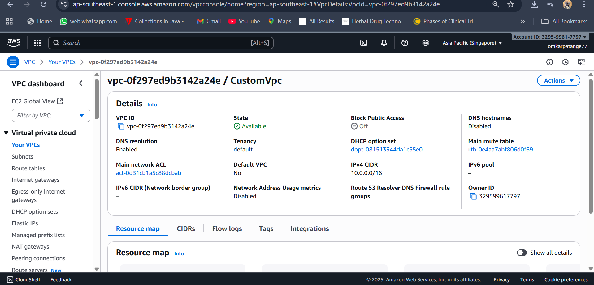
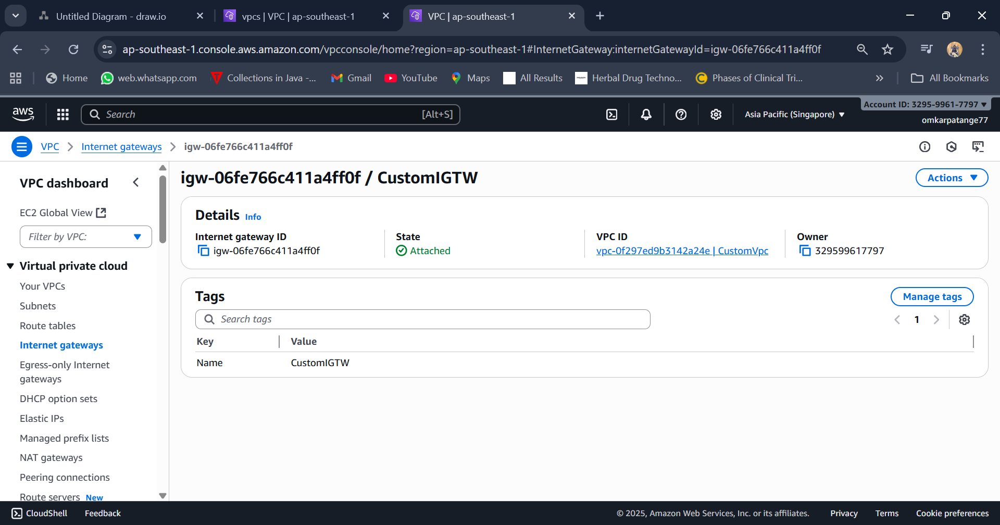

# Spotify-clone-minimal

A minimal full-stack demo of a Spotify-style music app. This repository provides a simple backend that streams audio files with support for range requests, and a React frontend that fetches track metadata and plays audio (with play / pause / seek / volume). It’s intended as a learning / starter project, not a production music streaming service..

---

## Features

- Backend:
  - Serve track metadata (id, title, artist, duration, file path)  
  - Stream audio files with HTTP Range support (so the browser/player can seek) 
  - Databses
    - Simple REST API (Express)

- Frontend:
  - Fetch track list from the server  
  - Select a track and play it  
  - Playback controls: play / pause, seek, volume  
  - Simple queue / “Now Playing” UI  

 
 

---

## Project Structure

spotify-clone-minimal/
├─ server/ 
│  ├─ package.json 
│  ├─ server.js 
│  ├─ tracks.json 
│  └─ audio/ 
│     └─ sample1.mp3  
├─ client/ 
│  ├─ package.json 
│  ├─ index.html 
│  └─ src/ 
│     ├─ index.jsx 
│     ├─ App.jsx 
│     └─ Player.jsx 
└─ README.md

Features

MVP features:
User Authentication (email/password, and optionally Spotify OAuth)
Browse & Search Catalog (albums, artists, tracks)
Playback (play / pause / seek / volume)
Playlists (create, delete, add/remove tracks)
“Liked” / Favorites
User Profile / Library
Now Playing / Queue
Advanced / later:
Recommendations & “Discover”
Lyrics display
Offline caching / download
Cross-device sync / resume
Social / share features
Admin panel for uploading / managing tracks
Analytics / statistics

| Layer                 | Tech                                         | Purpose / Notes                                    |
| --------------------- | -------------------------------------------- | -------------------------------------------------- |
| Frontend              | React or Next.js + Tailwind CSS              | Declarative UI, fast dev                           |
| Frontend state / data | React Query / SWR / Redux                    | Caching, orchestration                             |
| Backend / API         | Node.js + Express or Fastify                 | Handle auth, custom logic                          |
| Database              | PostgreSQL (or MySQL)                        | For users, playlists, metadata                     |
| Storage / CDN         | AWS S3 / CloudFront / or DigitalOcean Spaces | Store your audio files / cover art                 |
| Caching / State       | Redis                                        | For playback state, sessions, caching              |
| Media serving         | HTTP range requests, signed URLs             | For efficient streaming / seeking                  |
| Auth / Security       | JWT for your app; OAuth for third-party      | If you integrate with Spotify or external services |

Architecture Sketch

Client (React) ➝ communicates via REST / GraphQL to the backend

Backend: endpoints for auth, user data, playlists, search, streaming (or a link to storage)

Storage / CDN: audio files and media assets

Database: relational store for core data

If integrating with Spotify API (for metadata or even playback), your backend acts as a proxy / authenticator to Spotify. For playback via Spotify, you need to use Web Playback SDK / Spotify’s SDKs and respect their scopes / user permissions.

Data / Schema Ideas

Here’s a rough sketch:

User
- id (UUID or serial)
- email
- hashed_password
- display_name
- created_at, updated_at

Artist
- id
- name
- description
- image_url

Album
- id
- title
- artist_id
- release_date
- cover_url

Track
- id
- title
- album_id
- artist_id
- duration_ms
- audio_url  (URL to your audio file or S3 link)

Playlist
- id
- user_id
- name
- description
- is_public (boolean)
- created_at

PlaylistTrack  (join table)
- playlist_id
- track_id
- order (position)

LikedTracks
- user_id
- track_id

PlaybackState
- user_id
- current_track_id
- position_ms
- is_playing

## 🚀 AWS Three-Tier Architecture Deployment

Designed and deployed a scalable, secure, and highly available application using the Three-Tier Architecture model on AWS.

🔹 Presentation Layer (Frontend) – Hosted on Amazon EC2 / S3 with CloudFront for fast and reliable content delivery.

🔹 Application Layer (Backend) – Deployed on EC2 instances within private subnets for better security and compute processing.
 
🔹 Database Layer – Managed with Amazon RDS (MySQL/PostgreSQL) in a multi-AZ setup for high availability.
 
### VPC :-

🌐 Secured with VPC, public/private subnets, Internet Gateway, NAT Gateway, and Route Tables.
🛡️ Applied Security Groups & NACLs for network protection.
📈 Architecture ensures scalability, fault tolerance, and cost efficiency.

## CIDR Block
|  # | CIDR           | Network address | Usable host range       |   Broadcast | Total IPs | Usable IPs |
| -: | -------------- | --------------: | ----------------------- | ----------: | --------: | ---------: |
|  1 | `10.0.16.0/23` |       10.0.16.0 | 10.0.16.1 – 10.0.17.254 | 10.0.17.255 |       512 |        510 |
|  2 | `10.0.18.0/23` |       10.0.18.0 | 10.0.18.1 – 10.0.19.254 | 10.0.19.255 |       512 |        510 |
|  3 | `10.0.20.0/23` |       10.0.20.0 | 10.0.20.1 – 10.0.21.254 | 10.0.21.255 |       512 |        510 |
|  4 | `10.0.22.0/23` |       10.0.22.0 | 10.0.22.1 – 10.0.23.254 | 10.0.23.255 |       512 |        510 |
|  5 | `10.0.24.0/23` |       10.0.24.0 | 10.0.24.1 – 10.0.25.254 | 10.0.25.255 |       512 |        510 |
|  6 | `10.0.26.0/23` |       10.0.26.0 | 10.0.26.1 – 10.0.27.254 | 10.0.27.255 |       512 |        510 |
|  7 | `10.0.28.0/23` |       10.0.28.0 | 10.0.28.1 – 10.0.29.254 | 10.0.29.255 |       512 |        510 |
|  8 | `10.0.30.0/23` |       10.0.30.0 | 10.0.30.1 – 10.0.31.254 | 10.0.31.255 |       512 |        510 |
      |

### Alternative: More Subnets

If you prefer 3 AZs, or you want more separation (e.g. separate “web” vs “app” vs “API”), you could have 3 public subnets, 3 app subnets, 3 DB subnets, etc.

## Routing & Security

Public subnets have route to 0.0.0.0/0 via Internet Gateway.

App subnets have route to 0.0.0.0/0 via NAT Gateway(s) placed in public subnets.

DB subnets could have no direct route to Internet, or route only via NAT (or none, depending on isolation).

Use Security Groups / Network ACLs so that only App tier can talk to DB tier (on DB ports), Public tier can talk to App tier (HTTP, etc.), etc.

| Tier                        | AZ   | CIDR         | Purpose / Notes                                |
| --------------------------- | ---- | ------------ | ---------------------------------------------- |
| **Public**                  | AZ-1 | 10.0.0.0/24  | For load balancers, NAT gateway, bastion hosts |
| **Public**                  | AZ-2 | 10.0.1.0/24  | Same as above in second AZ                     |
| **App (private)**           | AZ-1 | 10.0.10.0/24 | Application servers, internal logic            |
| **App (private)**           | AZ-2 | 10.0.11.0/24 | App tier in AZ2                                |
| **DB (private / isolated)** | AZ-1 | 10.0.20.0/24 | Database servers (e.g. MySQL, PostgreSQL)      |
| **DB (private / isolated)** | AZ-2 | 10.0.21.0/24 | DB tier in AZ2                                 |

## Internet Gateway

An Internet Gateway is a VPC component that enables communication between resources inside a Virtual Private Cloud (VPC) and the Internet. 

It is horizontally scaled, redundant, and highly available — AWS abstracts away internal scaling/fault handling so you don’t worry about performance or single points of failure. 

It supports both IPv4 and IPv6 traffic (if the VPC and subnets have IPv6 configured)
